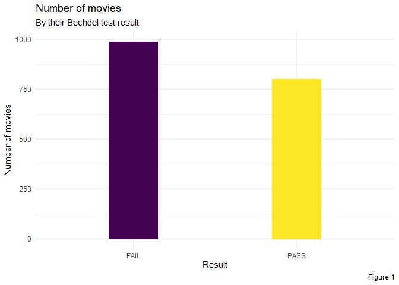
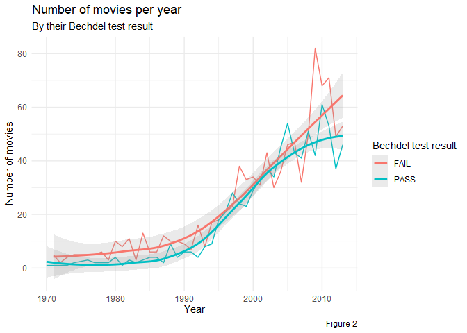
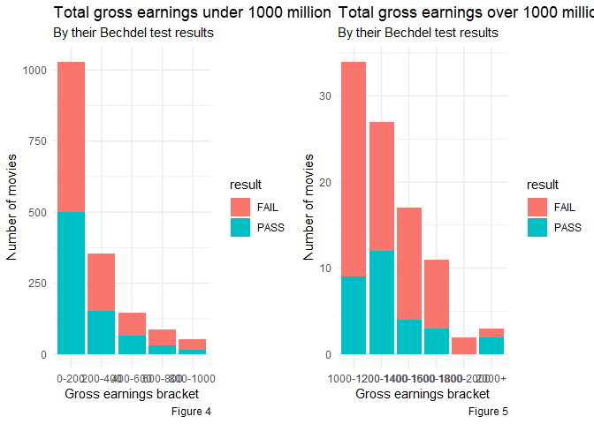
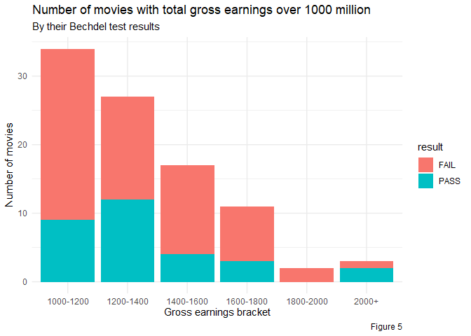

Bechdel Test
================
Pablo Ortuno
10/03/2021

#### Load and clean data

``` r
raw_bechdel <- read.csv("C:\\Users\\pablo\\Documents\\R Projects\\tidytuesday\\Data\\raw_bechdel.csv")
movies <- read.csv("C:\\Users\\pablo\\Documents\\R Projects\\tidytuesday\\Data\\movies.csv")
```

------------------------------------------------------------------------

``` r
reject = c("test", "imdb", "budget", "domgross", "intgross", "code", "period_code", "decade_code", "imdb_id", "response", "poster", "error")
bracket_levels = c('0-200', '200-400', '400-600','600-800','800-1000','1000-1200','1200-1400','1400-1600','1600-1800','1800-2000','2000+')

clean_movies <- movies %>%
  select(!reject) %>%
  rename('budget' = budget_2013,
         'domgross' = domgross_2013,
         'intgross' = intgross_2013,
         'result' = binary) %>%
  mutate(domgross = as.integer(domgross),
         intgross = as.integer(intgross),
         total_gross = (domgross + intgross)*(10^-6),
         bracket = case_when(
           0 <= total_gross & total_gross < 200 ~ '0-200',
           200 <= total_gross & total_gross < 400 ~ '200-400',
           400 <= total_gross & total_gross < 600 ~ '400-600',
           600 <= total_gross & total_gross < 800 ~ '600-800',
           800 <= total_gross & total_gross < 1000 ~ '800-1000',
           1000 <= total_gross & total_gross < 1200 ~ '1000-1200',
           1200 <= total_gross & total_gross < 1400 ~ '1200-1400',
           1400 <= total_gross & total_gross < 1600 ~ '1400-1600',
           1600 <= total_gross & total_gross < 1800 ~ '1600-1800',
           1800 <= total_gross & total_gross < 2000 ~ '1800-2000',
           2000 < total_gross ~ '2000+'))

clean_movies$bracket <- factor(clean_movies$bracket, levels = bracket_levels)
```

### Figures

<!-- -->

Figure 1 shows how there are more movies which fail the Bechdel test. In
fact, there are 991 movies that fail the test, and 803 which pass it.

<!-- -->

Figure 2 shows the evolution from 1970 to 2013 in the number of movies
which pass or fail the Bechdel test. Even though the Bechdel test was
introduced in 1985, there doesn’t seem to have been a clear
pre/post-Bechdel shift. The figure shows how approximately the number of
movies released every year which fail the Bechdel test is greater than
the number of movies which pass it.

<!-- -->

This figure illustrates the rate of change of movies which pass or fail
the Bechdel test. Ifthe Bechdel test had a relevant impact in the movie
making industry, we would see a positive trend in the ‘pass’ graph after
1985, which is not the case. Both graphs having similar rates of change
indicates how the movie industry has upscaled it’s movie production
without taking into consideration the Bechdel test .

<!-- -->

This figure looks at all the movies in the dataset with total gross
earnings (domestic and international) under 1000 million USD. In all of
the brackets the distribution of gross earnings is roughly split equally
between movies which pass or not the Bechdel test.

<!-- -->

This figure looks at all the movies in the dataset with total gross
earnings over 1000 million. We can see how movies which fail the Bechdel
test have greater earnings in the ‘1000-1200’, ‘1400-1600’, ‘1600-1800’,
and ‘1800-2000’ brackets. The ‘1200-1400’ bracket is split more equally.
The ‘2000+’ bracket is the only bracket in the figure where “Pass”
movies outnumber “Fail” movies. The three movies (in gross earnings
order) in this bracket are: ‘Star Wars: Episode I - The Phantom Menace’,
‘Star Wars: Episode VI - Return of the Jedi’, and ‘Grease’. ‘.5Star
Wars: Episode I’ and ‘Grease’ pass the Bechdel test. ‘Star Wars: Episode
VI’ doesn’t

<!-- -->

Distribution of Imdb ratings is left-skewed in both cases and quite
similar. The distributions between 2 and 8 ratings are quite similar.
However, many more movies which fail the Bechdel test have an 8+ rating.
